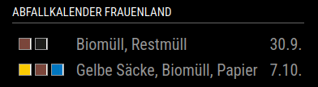

## MMM-WasteCollectionWuerzburg

This is a Magic Mirror module to display waste collection dates of Würzburg on your [Magic Mirror](https://github.com/MagicMirrorOrg/MagicMirror) displays.

It uses [OpenData Platform Würzburg](https://opendata.wuerzburg.de) and its [Waste collection API endpoint](https://opendata.wuerzburg.de/explore/dataset/abfallkalender-wuerzburg/api).


### How to use
1. Clone this repo into your Magic Mirrors modules directory with the following command: git clone https://github.com/mercredo/MMM-WasteCollectionWuerzburg.git.
2. Install all the npm modules with *npm install*.
3. Insert module config into Magic Mirror config.

### Configuration Options
| Option | Description |
|---|---|
| title | Title to display at the top of the module. <br><br> |
| districts | Specify Würzburg districts to be displayed.
| categories | Specify Waste Collection categories to be displayed. <br><br> |
| updateInterval | Data refresh interval in milliseconds. <br><br> **Default:** 604800*1000 |
| showTypes | Print out waste type names. <br><br> **Default:** true |
| showDistrict | Print out district name. Recommended if you select multiple districts. <br><br> **Default:** false |
| showYear | Display year in date column. **Default:** false |
| rowsMax | How many rows to be displayed. **Default:** 5


```
districts: [
    'Altstadt',
    'Frauenland',
    'Dürrbach alle mit Hafen',
    'Grombühl',
    'Heidingsfeld',
    'Heuchelhof innen',
    'Heuchelhof aussen',
    'Lengfeld',
    'Lindleinsmühle',
    'Mainviertel',
    'Neumühle',
    'Pilziggrund',
    'Rottenbauer',
    'Sanderau',
    'Steinbachtal',
    'Versbach',
    'Zellerau'
],
categories: [
    'Restmüll',
    'Biomüll',
    'Gelbe Säcke',
    'Papier',
    'Problemmüll-Sammlung',
    'Wertstoffmobil'
],
showTypes: true, // displays waste type names next to icons
showDistrict: false, // this should be enaled if you use multiple districts
showYear: false,
rowsMax: 5 // max num rows to be displayed; 0 for unlimited

```

### My configuration for a single district (Frauenland)



```json
{
        module: "MMM-WasteCollectionWuerzburg",
        position: "top_left",
        config: {
            title: 'Abfallkalender Frauenland',
            rowsMax: 2,
            districts: ['Frauenland'],
            categories: [ 
                'Restmüll',
                'Biomüll',
                'Gelbe Säcke',
                'Papier'
            ]
        }
}
```